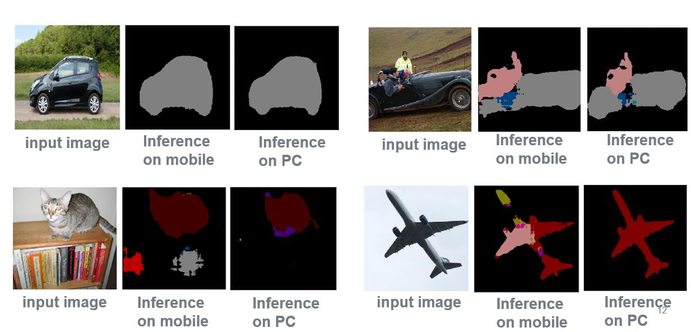

# Introduction
The final project of deep learning course.
* The image segmentation task on PASCAL dataset (21 classes)  
* Implementation of U-Net in tensorflow
* Inference the result on Qualcomm chip

## Results

Here is the example of comparison with PC and Qualcomm chip: 
 
